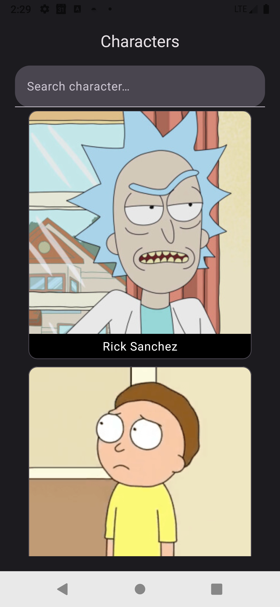
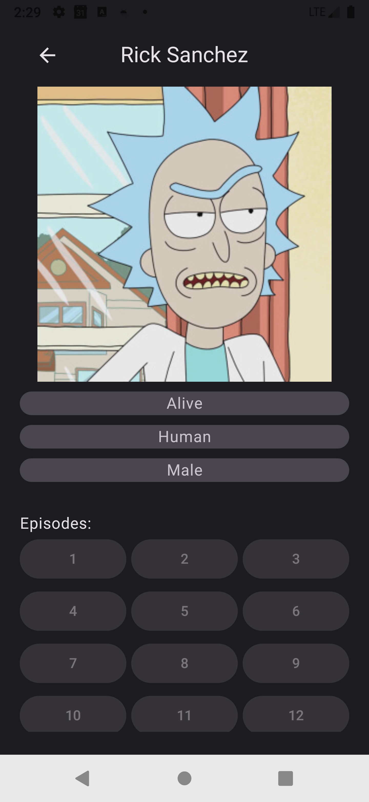

# 🧪 RickAnMortyTechnicalTest

## 📖 Introducción

**RickAnMortyTechnicalTest** es una aplicación Android desarrollada como prueba técnica para Mango. Su objetivo es mostrar un listado infinito de personajes de la serie *Rick and Morty* y permitir consultar información detallada de cada uno.

La app se desarrolló aplicando buenas prácticas de Clean Architecture, patrón **MVVM**.

> 📝 Esta app utiliza la API pública de [Rick and Morty](https://rickandmortyapi.com/).

---

## ✨ Funcionalidades

- Listado paginado de los personajes
- Búsqueda de personajes por nombre
- Gestión de estados: carga, error, éxito
- Navegación al detalle de personaje
- Vista de detalle con:
  - Imagen, nombre, género y especie del personaje
  - Lista de episodios en los que aparece
- Opción de Retry si se producen errores
- Splash Screen al iniciar
- UI desarrollada 100% con Jetpack Compose

---

## ⚙️ Tecnologías utilizadas

- **Lenguaje:** Kotlin
- **UI:** Jetpack Compose
- **Arquitectura:** MVVM + Clean Architecture
- **Inyección de dependencias:** Hilt
- **Paginación:** Paging 3
- **Cliente HTTP:** Retrofit + Gson
- **Corrutinas:** Kotlin Coroutines + Flow/StateFlow
- **Navegación:** Navigation Compose with Type-safe
- **Pruebas:** JUnit + Mockito (unitarias)
- **CI:** GitHub Actions


## 🏗️ Estructura del proyecto

```
RickAnMortyTechnicalTest
│── app
│   ├── data
│   │   ├── paging
│   │   ├── remote
│   │   │   ├── dto
│   │   ├── repository
│   ├── domain
│   │   ├── mapper
│   │   ├── model
│   │   ├── repository
│   │   ├── usecase
│   ├── presentation
│   │   ├── navigation
│   │   ├── ui
│   │   ├── viewmodel
│   ├── di
│   ├── common
```

### Requisitos previos

- Android Studio **Koala** | 2024.1.1 Patch 1 or later (this is my version)

### Instalación

1. **Copia la url del repositorio**

```sh
git clone https://github.com/RVenturaSuarez/RickAnMortyTechnicalTest.git
```

2. **Abre el proyecto en Android Studio**

   - Abre Android Studio
   - Haz click en el botón `Get from VCS`
   - Pega la url del proyecto `https://github.com/RVenturaSuarez/RickAnMortyTechnicalTest.git`
   - Selecciona la carpeta donde quieres guardarlo
   - Haz click en el botón clone

3. **Ejecuta el proyecto**

   - Pulsa en Sync Gradle files
   - Haz click en el botón `Run` ▶️ in Android Studio

## ✅ Ejecución de pruebas

Para lanzar los Unit Test, ejecuta en el terminal:

```sh
./gradlew testDebugUnitTest
```

## 🔧 CI GitHub Actions

Este proyecto incluye un flujo de trabajo de GitHub Actions para pruebas automatizadas. Ejecuta las pruebas en cada push o pull request a las ramas `master` y `develop`


## 📸 Pantallas



